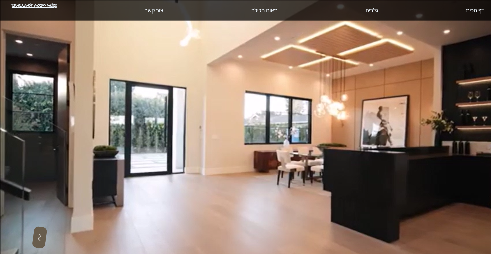
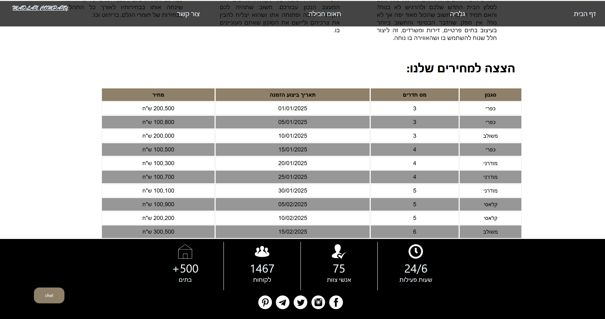
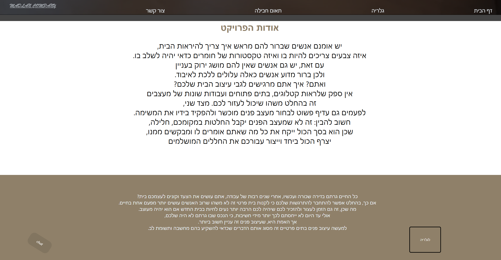
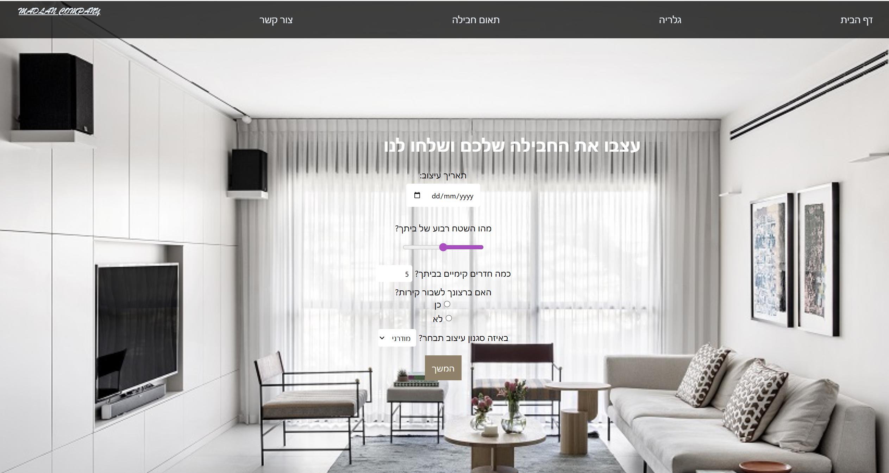
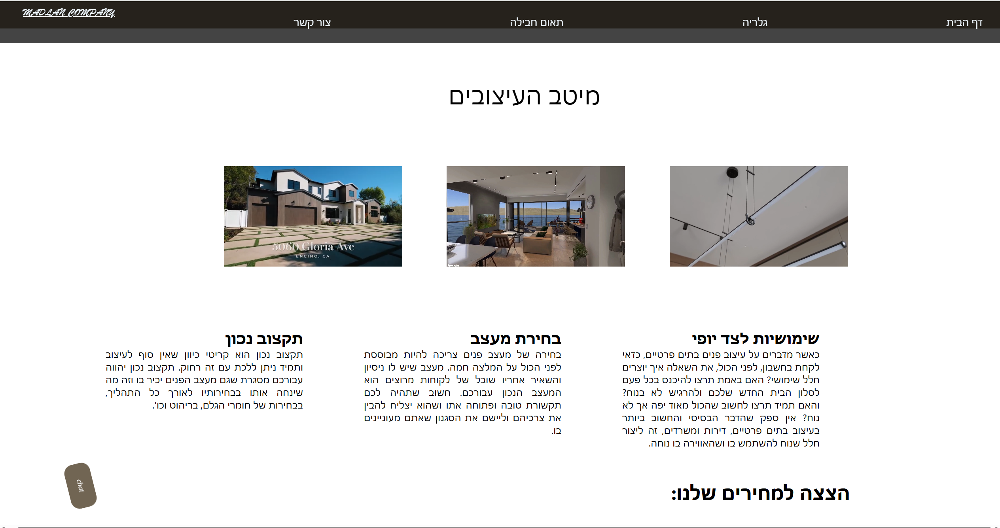
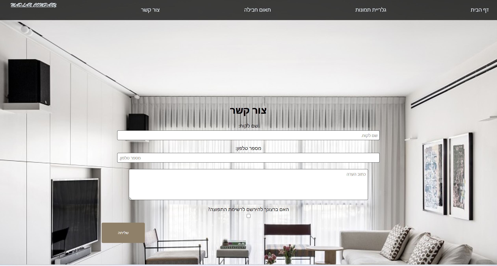
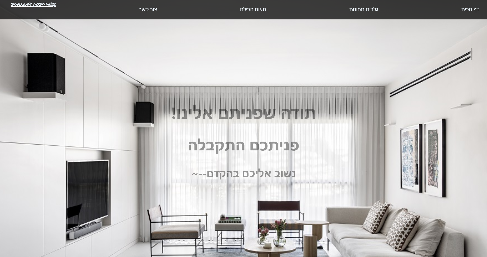
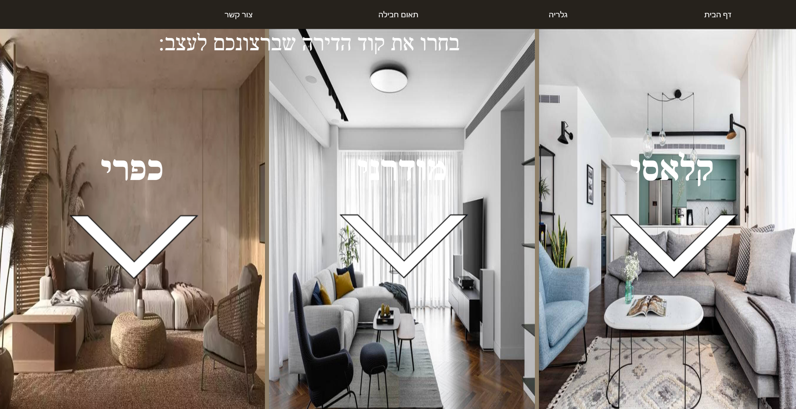
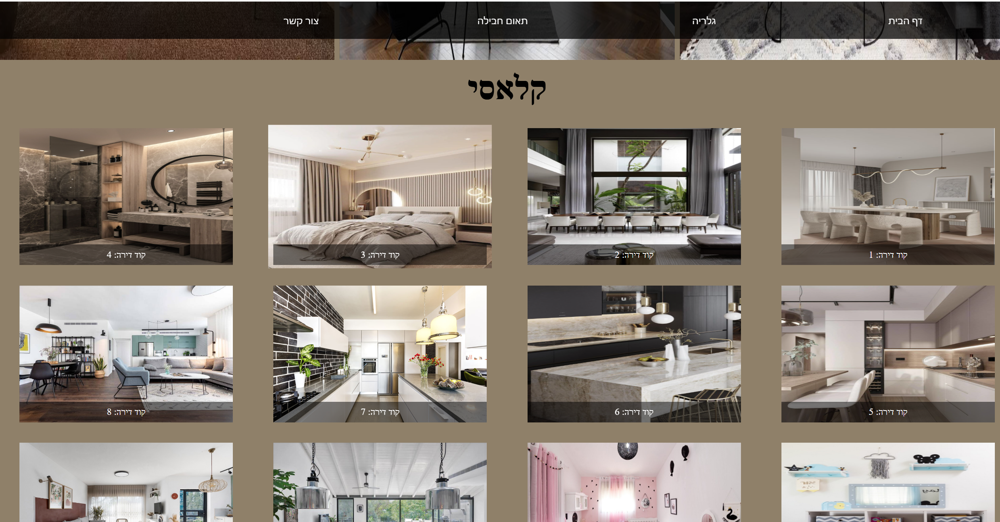
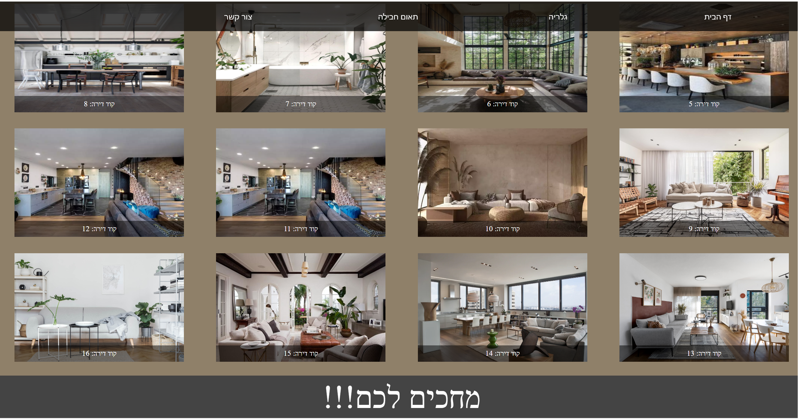

lets see a few pictures!!

> - 🎨 **Modern UI**: Clean, design with gradient accents

> - 📱 **Responsive**: Works seamlessly on desktop, tablet, and mobile devices

> - 💥 **Responsive**: Works seamlessly on desktop, tablet, and mobile devices

> - 📖 **Responsive**: Works seamlessly on desktop, tablet, and mobile devices

> - 🌓 **Dark Mode Support**: Automatically adapts to system dark mode preference

> - ⚡ **Smooth Animations**: Delightful transitions and slide-in effects

> - 🙏 **Smooth Animations**: Delightful transitions and slide-in effects

> - ⚡ **Smooth Animations**: Delightful transitions and slide-in effects

> - ⚡ **Smooth Animations**: Delightful transitions and slide-in effects

> - ⚡ **Smooth Animations**: Delightful transitions and slide-in effects

## 👩‍💻 Author

Rivky Peretz
[GitHub](https://github.com/rivky9523)
[Email](mailto:r0548551732@gmail.com)
